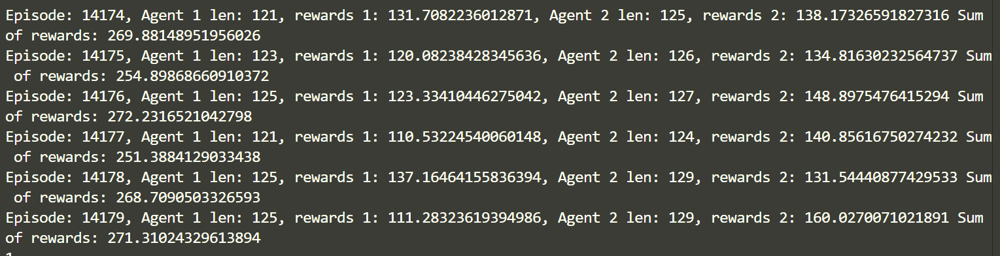
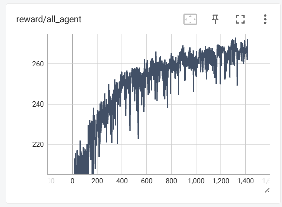

# ！不要别人的reward
#  125个任务一个无人机，最高272的reward
CUDA_VISIBLE_DEVICES=3 python train_parse.py --eps_clip 0.2  --gamma 0.99 --lr_actor 0.0005 --lr_critic 0.0008 --pre_reward_ratio 2 --reward_scale_size 50000 --entropy_ratio 0.08  --K_epochs 1 --M 2 --gae-lambda 0.99 --buffer_punishment --BS_back_times 6 --punishment_value 4

